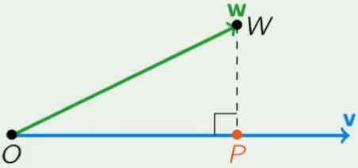

# Course #8: Geometry

# Platform: Edx

# Course Name: DelftX Calc001x: Pre-University Calculus

## unknown keywords

| english           | phonetic symbol   | chinese meaning |
| :---------------: | :---------------: | :-------------: |
| geometry          | dʒɪˈɑmǝtrɪ        | 幾何學           |
| projection        | prǝˈdʒɛkʃǝn       | 投影             |
| Cartesian         | kɑrˈtiʒǝn         | 笛卡兒           |
| coordinate        | koˈɒrdṇеt         | 座標             |
| equilateral       | ˌikwɪˈlætǝrǝl     | 等邊的；等邊形    |
| clockwise         | ˈklɑkˌwaɪz        | 順時針           |
| isosceles         | aɪˈsɑsḷˌiz        | 二等邊的；等腰的  |
| counterclockwise  | ˌkaʊntɚˈklɑkˌwaɪz | 逆時針           |
| magnitude         | ˈmæɡnǝˌtjud       | 大小             |
| quadrilateral     | ˌkwɑdrɪˈlætǝrǝl   | 四邊形；四邊形的  |
| rhombus           | ˈrɑmbǝs           | 菱形             |
| parallelogram     | ˌpærǝˈlɛlǝˌɡræm   | 平行四邊形       |
| trapezoid         | ˈtræpǝˌzɒɪd       | 梯形；梯形的     |
| perpendicular     | ˌpɝpǝnˈdɪkjǝlɚ    | 垂直的          |
| Pythagorean       | paɪˈθæɡɒrɪǝn      | 畢達哥拉斯       |
| theorem           | ˈθiǝrǝm           | 定理            |
| scalar            | ˈskеlɚ            | 數量            |
| obtuse            | ǝbˈtjus           | 鈍角的          |
| acute             | ǝˈkjut            | 銳角的          |
| right             | raɪt              | 直角的          |
| parallel          | ˈpærǝˌlɛl         | 平行的；平行線   |
| hexagon           | ˈhɛksǝˌɡǝn        | 六邊形          |
| orthogonal        | ɒrˈθɑɡǝnǝl        | 直角的          |
| equidistance      | ˈikwɪˈdɪstṇs      | 等距離          |
| bisector          | baɪˈsɛktɚ         | 二等分線        |

## Cartesian coordinate

### D(dimension)
* 0D: a `point`, **has no length, width, or height**
* 1D: a `line`, **only has length, hasn't width or height**
* 2D: a `plane`, **has both length and width, but no thickness**
* 3D: a `space`, **has length, width and height(depth)**

### coordinate
1. 2D
    * `(x, y)`
    * two axes: `x-axis` and `y-axis`
    * `x-axis` (**horizontal**): how far **left(negative) or right(positive)**
    * `y-axis` (**vertical**): how far **up(positive) or down(negative)**
2. 3D
    * `(x, y, z)`
    * three axes: `x-axis`, `y-axis` and `z-axis`
    * add a z-axis (**depth**): how far **out(positive) or in(negative)**
3. origin
    * a point where all axes meet
    * 2D: `(0, 0)`
    * 3D: `(0, 0, 0)`

### rotation formula
* to rotate a point (x, y) around the origin by an angle $\theta$, and the rotates the point **counterclockwise** by $\theta$ degrees
* formula
    * rotated point: `(x', y')`
    * original point: `(x, y)`
    $$x' = x \times \cos(\theta) - y \times \sin(\theta)$$
    $$y' = x \times \sin(\theta) + y \times \cos(\theta)$$
    * matrix format
    $$
    \begin{bmatrix}
    x'\\
    y'
    \end{bmatrix}
    = 
    \begin{bmatrix}
    \cos(\theta) \quad -\sin(\theta)\\
    \sin(\theta) \quad \cos(\theta)
    \end{bmatrix}
    \times
    \begin{bmatrix}
    x\\
    y
    \end{bmatrix}
    $$

### distance
* photo

* formulas
    $$d = \sqrt{\Delta x^2 + \Delta y^2}$$
    $$= \sqrt{\lvert x1 - x2\rvert^2 + \lvert y1 - y2\rvert^2}$$

## vectors

### definition
* a vector shows how far and in what direction to go from a point to another
* a vector has two pieces of information:
    1. direction
    2. magnitude(length)

### notations
1. `arrow notation`, **BEST**:
    * from point `A` to point `B`:
        $$\vec{AB}$$
    * from point `(1, 2)` to point `(3, 4)`
        $$\vec{V} =
        \begin{pmatrix}
        3 - 1\\
        4 - 2
        \end{pmatrix}
        =
        \begin{pmatrix}
        2\\
        2
        \end{pmatrix}$$
2. `bold font`:
    * from point `A` to point `B`: 
        $$\boldsymbol{V} = \vec{AB}$$
    * from point `(1, 2)` to point `(3, 4)`
        $$\boldsymbol{V} = 
        \begin{pmatrix}
        3 - 1\\
        4 - 2
        \end{pmatrix}
        =
        \begin{pmatrix}
        2\\
        2
        \end{pmatrix}
        $$
    * You should definite a vector to use
3. `component form`:
    * from point `A` to point `B`:
        $$\langle B_x - A_x, B_y - A_y \rangle$$
    * from point `(1, 2)` to point `(3, 4)`
        $$\langle 3 - 1, 4 - 2 \rangle = \langle 2, 2 \rangle$$
    * This only contain values, but name
4. `column vector`
    * from point `A` to point `B`:
        $$
        \begin{bmatrix}
        B_x - A_x\\
        B_y - A_y
        \end{bmatrix}
        $$
    * from point `(1, 2)` to point `(3, 4)`
        $$
        \begin{bmatrix}
        3 - 1\\
        4 - 2
        \end{bmatrix}
        =
        \begin{bmatrix}
        2\\
        2
        \end{bmatrix}
        $$
    * This only contain values, but name

### zero vector $\vec{0}$
* $\vec{0}$ has
    1. zero length
    2. no direction

### magnitude (length) of a vector
* using a Pythagorean theorem
* formula
    $$\| \vec{V} \| = \sqrt{V_x^2 + V_y^2}$$
* example: $\vec{V} = \begin{pmatrix} 3\\4 \end{pmatrix}$
    $$\| \vec{V} \| = \sqrt{3^2 + 4^2} = 5$$

### calculation rules
1. addition
    * photo

    
    * $$\vec{AB} + \vec{BC} = \vec{AC}$$
    * the new vector is from the first vector's head to the second vector 's toe
    * $$\vec{u} + \vec{v} = \langle u_x + v_x, u_y + v_y\rangle$$
2. subtraction
    * $$\vec{AB} - \vec{AC} = \vec{CB}$$
3. multiplication
    * photo

    
    * for $\vec{v} \times c$
    1. for `c > 0`
        1. direction doesn't change
        2. length multiplied by c
    2. for `c < 0`
        1. direction is opposite of $\vec{v}$
        2. length multiplied by $\lvert c \rvert$
4. scalar multiplication
    * $$k \vec{v} = \langle kv_x, kv_y \rangle$$
5. dot product
    * photo

    
    * geometric formula
    $$\vec{V} \cdot \vec{W} = \| \vec{V} \| \cdot \| \vec{W} \| \cdot \cos(\alpha)$$
    * algebraic formula
        $$
        \begin{pmatrix}
        2\\
        3
        \end{pmatrix}
        \cdot
        \begin{pmatrix}
        1\\
        -1
        \end{pmatrix}
        =
        2 \cdot 1 + 3 \cdot (-1) = -1
        $$
    * types of angle
        * the angle is $[0, \pi]$ in radians, or $[0 \degree, 180 \degree]$ in degree
        1. $\vec{V} \cdot \vec{W} < 0$
            * the angle is an obtuse angle
            * or $(\frac {\pi} {2}, \pi]$ in radians
            * or $(90 \degree, 180 \degree]$ in degree
        2. $\vec{V} \cdot \vec{W} > 0$
            * the angle is an acute angle
            * or $[0, \frac {\pi} {2})$ in radians
            * or $[0 \degree, 90 \degree)$ in degree
        3. $\vec{V} \cdot \vec{W} = 0$
            * the angle is a right angle
            * or $\frac {\pi} {2}$ in radians
            * or $90 \degree$ in degree
    * calculation rules
        1. `commutativity`
            * $$\vec{V} \cdot \vec{W} = \vec{W} \cdot \vec{V}$$
        2. `distributivity`
            * $$\vec{U} \cdot (\vec{V} + \vec{W}) = \vec{U} \cdot \vec{V} + \vec{U} \cdot \vec{W}$$
        3. scalar rule
            * `c` is a scalar
            * $$(c \vec{V}) \cdot \vec{W} = \vec{V} \cdot (c \vec{W}) = c \cdot (\vec{V} \cdot \vec{W})$$
        4. zero vector rule
            * if $\vec{V} \cdot \vec{V} = 0$, then $\vec{V} = \vec{0}$
    * warnings
        1. $\vec{U} \cdot \vec{V} \cdot \vec{W}$ is **not defined**
        2. $\vec{V}^2$ is **not defined**, always write $\vec{V} \cdot \vec{V}$ or $\| \vec{V} \| ^2$ instead

## projection

### definition
* photo

    
* $\vec{OP}$ is the projection of $\vec{W}$ and $\vec{V}$
* formulas
    1. $$\vec{OP} \parallel \vec{V} \Rightarrow \vec{OP} =c \vec{V}$$
    2. $$\vec{PW} \perp \vec{V} \Rightarrow \vec{PW} \cdot \vec{V} = 0$$
    3. $$\vec{OP} = \frac {\vec{W} \cdot \vec{V}} {\vec{V} \cdot \vec{V}} \vec{V}$$
        * proof
        $$
        \vec{PW} = \vec{OW} - \vec{OP}\\
        = \vec{W} - c \cdot \vec{V}\\
        (\vec{W} - c \cdot \vec{V}) \cdot \vec{V} = 0\\
        \vec{W} \cdot \vec{V} - c \cdot \vec{V} \cdot \vec{V} = 0\\
        \vec{W} \cdot \vec{V} = c \cdot \vec{V} \cdot \vec{V}\\
        c = \frac{\vec{W} \cdot \vec{V}} {\vec{V} \cdot \vec{V}}\\
        \vec{OP} = c \cdot \vec{V}\\
        \vec{OP} = \frac{\vec{W} \cdot \vec{V}} {\vec{V} \cdot \vec{V}} \vec{V}
        $$
    4. $$\cos(\alpha) = \frac {\vec{V} \cdot \vec{W}} {\| \vec{V} \| \| \vec{W} \|}$$
        * proof
        $$
        \cos(\alpha) = \frac {\| \vec{P} \|} {\| \vec{W} \|}\\
        = \frac {\| \frac {\vec{V} \cdot {\vec{W}}} {\vec{V} \cdot \vec{V}} \vec{V} \|} {\| \vec{W} \|}\\
        = \frac {\vec{V} \cdot \vec{W}} {\vec{V} \cdot \vec{V}} \frac {\| \vec{V} \|} {\| \vec{W} \|}\\
        = \frac {\vec{V} \cdot \vec{W}} {\| \vec{V} \|^2} \frac {\| \vec{V} \|} {\| \vec{W} \|}\\
        = \frac {\vec{V} \cdot \vec{W}} {\| \vec{V} \| \| \vec{W} \|}
        $$

## circle

### definition
* a shape consisting all points in a plane that are given a distance (`radius`) from a given point (`center`) 
* photo

### equations
1. standard equation
    $$(x - a)^2 + (y - b)^2 = r^2$$
    * where
        1. $(x, y)$: any point on the circle satisfies this equation
        2. $(a, b)$: center
        3. $r$: radius
2. general form
    $$x^2 + y^2 + Dx + Ey + F = 0$$
    * to find the center and radius from the general form of a circle, we complete the square to convert it into the standard form
3. parametric form
    $$x = h + r \cos(\theta)\\y = k + r \sin(\theta)$$
    * where
        1. $\theta \in [0, 2 \pi]$
        2. $(h, k)$: center
        3. $r$: radius

## line

### vector equation
$$\vec{r} = \vec{a} + \lambda \vec{b}$$
* where
    1. $\vec{r}$ is the position vector of any point on the line
    2. $\vec{a}$ is a fixed point on the line (starting point)
    3. $\vec{b}$ is the normal vector of the line
    4. $t$ is a real number parameter
* normal vector
    * line: $Ax + By + C = 0$
    * normal vector: $\begin{pmatrix} A\\ B\end{pmatrix}$
### line segment
* we can divide the line into two parts
* photo

* formula
    $$
    \vec{AP} = t \vec{AB}\\
    = \begin{pmatrix}
    3t\\
    -5t \end{pmatrix}\\ P(2 + 3t, 4 - 5t)
    $$

## velocity and acceleration

* velocity has a direction, it's a vector: $\vec{v}$
* speed is just a magnitude, it's a magnitude of a vector: $\| \vec{v} \|$
* velocity at time t:
$$
\vec{v}(t) = \lim_{\Delta t \rightarrow 0}\vec{v}_{average}\\
= \lim_{\Delta t \rightarrow 0} \frac
{\begin{pmatrix}
x(t + \Delta t) - x(t)\\
y(t + \Delta t) - y(t)
\end{pmatrix}}
{\Delta t}\\
= \lim_{\Delta t \rightarrow 0}
\begin{pmatrix}
\frac {x(t + \Delta t) - x(\Delta t)} {\Delta t}\\
\frac {y(t + \Delta t) - y(\Delta t)} {\Delta t}
\end{pmatrix}\\
= \begin{pmatrix}
x'(t)\\
y'(t)
\end{pmatrix}
$$
* speed at time t:
$$\| \vec{v} \| = \sqrt{(x'(t))^2 + (y'(t))^2}$$
* acceleration at time t:
$$\vec{a}(t) = \vec{v}'(t)\\
=\begin{pmatrix}
x''(t)\\
y''(t)
\end{pmatrix}$$

## 3D-vectors

* 3D vectors are just like 2D vectors, but with an added z-axis component, representing depth
    $$\vec {v} =
    \begin{pmatrix}
    x\\
    y\\
    z
    \end{pmatrix}
    $$
* all the basic calculation rules for 2D vectors (like addition, subtraction, scalar multiplication, dot product) also apply in 3D, just with the z-component added: